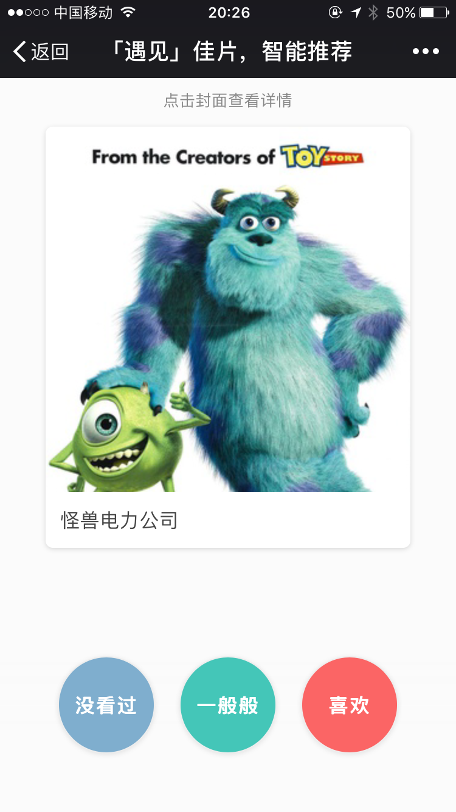

# cenim
Cenim is a mobile web app which aimed to collect users' movie ratings, meanwhile it also provide basic recommendation based on movie clustering(K-Means).

## Mobile Web App

## Analytics behind the Scene
See project [cenim-analytics](https://github.com/magiccube/cenim-analytics).
